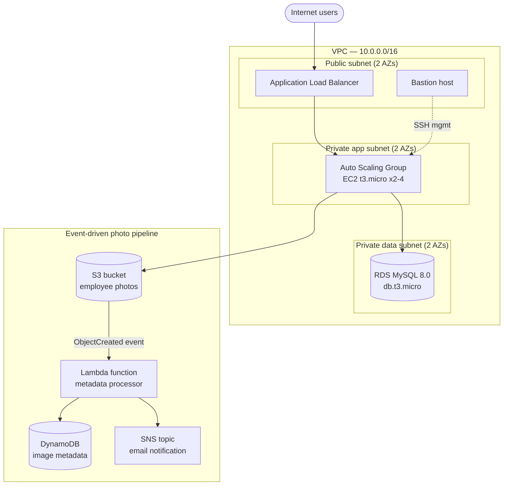

# XYZ Company — AWS 3-Tier Employee Platform (Terraform)

A complete, disposable 3-tier AWS environment provisioned with Terraform:
public/private networking, a load-balanced auto-scaling app tier, a
private RDS database, an event-driven photo pipeline (S3 → Lambda →
DynamoDB), and SNS notifications — built as reusable modules with
environment-specific wiring and remote state management.

## Why this project

Built as a hands-on case study to demonstrate infrastructure-as-code
delivery: designing a production-shaped network topology, wiring
least-privilege IAM between services, structuring Terraform the way a
team would (centralized modules + per-environment configuration), and
operating it end-to-end — remote state, locking, and a full provision →
verify → teardown cycle with cost awareness at every stage.

## Architecture



**Networking:** 1 VPC across 2 AZs, 6 subnets (2 public / 2 private-app /
2 private-data), 1 Internet Gateway, 1 NAT Gateway for private-subnet
egress, route tables per tier.

**Compute:** ALB fronting an Auto Scaling Group (min 2 / max 4) of
private EC2 app instances; a public bastion host for SSH management
access, isolated by security group.

**Data:** RDS MySQL (private, reachable only from the app tier security
group), an S3 bucket for employee photo storage, and a DynamoDB table
for image metadata (on-demand billing).

**Event pipeline:** S3 object-created events trigger a Lambda function
that writes metadata to DynamoDB and publishes a notification to an SNS
topic, which emails a subscriber.

**IAM:** Purpose-built roles for EC2 (S3 read/write, DynamoDB read) and
Lambda (S3 read, DynamoDB write, CloudWatch Logs) — no wildcard
permissions.

## Project structure

This follows a standard layered pattern: **environments** hold thin,
environment-specific wiring; **modules** hold the actual reusable
resource logic. In a multi-environment or multi-engineer setup, modules
would typically be pinned to versioned tags in a separate repo — here
they're sourced locally, since this is a single-environment case study,
but the module boundaries are the same either way.

```
bootstrap/                one-time setup: S3 state bucket + DynamoDB lock table

modules/
  network/                 VPC, subnets, IGW, NAT gateway, route tables
  security/                security groups (ALB, bastion, app, RDS)
  loadbalancer/             ALB, target group, listener
  data/                     S3 bucket, DynamoDB table, RDS instance
  iam/                      IAM roles and policies (EC2, Lambda)
  compute/                  AMI lookup, bastion host, launch template, ASG
  notifications/            SNS topic, Lambda function, S3 event trigger

environments/
  dev/
    main.tf                 wires the modules together for dev
    variables.tf             input variables (with defaults where sensible)
    provider.tf              AWS provider + remote S3/DynamoDB backend
    outputs.tf                ALB DNS name, bastion IP, RDS endpoint, etc.
    versions.tf                Terraform + provider version constraints
    dev.tfvars.example        template — copy to dev.tfvars, fill in, never commit
```

Each module declares its own `variables.tf` (explicit inputs, no reaching
into global state) and `outputs.tf` (only what downstream modules or the
environment actually need) — so any module could be lifted into a
`staging/` or `prod/` environment, or a separate versioned repo, without
changes.

## Remote state

State is stored in S3 (versioned, encrypted, public access blocked)
with a DynamoDB table for locking, so concurrent applies fail safely
instead of corrupting state. See `environments/dev/provider.tf` and
`bootstrap/` for setup.

## Architecture Decisions

Infrastructure design choices are documented in Architecture Decision Records (ADRs):

- [ADR 0007: Compute Platform Selection (EKS vs EC2+ASG)](docs/adr/0007-compute-platform-eks-vs-ec2.md) 
    — Why we chose managed Kubernetes over traditional EC2 auto-scaling

For all infrastructure ADRs, see [docs/adr/](docs/adr/).

## Usage

```bash
# One-time: create the remote state backend
cd bootstrap
terraform init && terraform apply
terraform output   # copy bucket / table names into environments/dev/provider.tf

# Main project
cd ../environments/dev
cp dev.tfvars.example dev.tfvars   # fill in db_password, notification_email
terraform init       # migrates local state to S3 when prompted
terraform plan -var-file="dev.tfvars"
terraform apply -var-file="dev.tfvars"
terraform destroy -var-file="dev.tfvars"   # tear down when done — see cost notes below
````

## Cost notes

This environment is meant to be provisioned, verified, and destroyed —
not left running. On-demand hourly cost is roughly $0.10–$0.12/hr,
dominated by the NAT Gateway and ALB (both bill a minimum of a full
hour even for a few minutes of use). Always confirm `terraform destroy`
completes fully, and double-check for orphaned NAT Gateways or
unattached Elastic IPs afterward — those are the two resources most
likely to keep billing silently if a destroy is interrupted.
